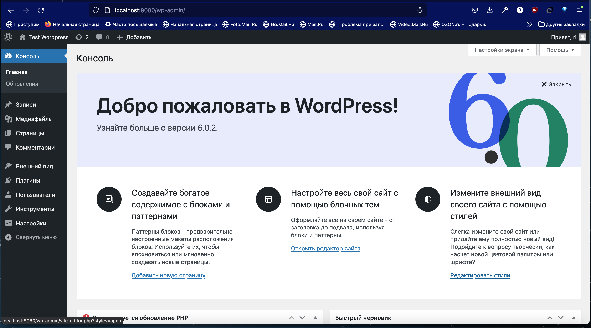
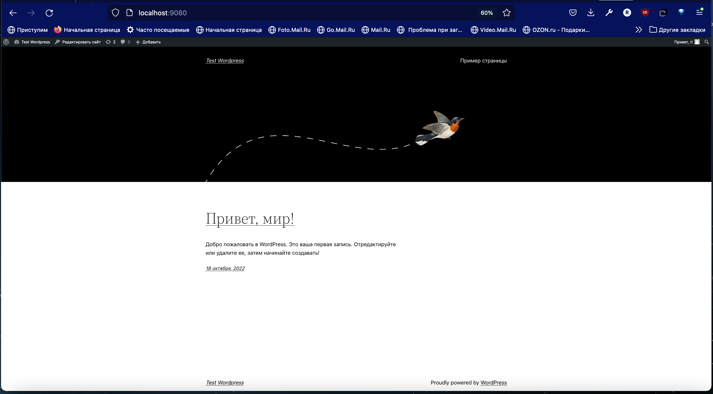

# Урок 8. Запуск веб-приложения из контейнеров

    
##   Задание 1. Установить в виртуальную машину или VDS Docker, настроить набор контейнеров через docker compose по инструкции по ссылке: https://www.digitalocean.com/community/tutorials/how-to-install-wordpress-with-docker-compose-ru. Часть с настройкой certbot и HTTPS опустить, если у вас нет настоящего домена и белого IP.

### Скриншоты работы Worpress

  

  

  

##   Задание 2. Запустить два контейнера, связанные одной сетью (используя документацию). Первый контейнер БД (например, образ mariadb:10.8), второй контейнер — phpmyadmin. Получить доступ к БД в первом контейнере через второй контейнер (веб-интерфейс phpmyadmin).

Для запуска двух контейнеров, связанных одной сетью, использовать команду docker network create для создания новой сети,
 пример: 

``` docker network create my_network ``` 

Затем нужно запустить первый контейнер с использованием созданной сети, 
 например, используя образ MariaDB версии 10.8: 

``` docker run -d --name db --network my_network -e MYSQL_ROOT_PASSWORD=my_password mariadb:10.8 ``` 

В этом примере мы запускаем контейнер в фоновом режиме, с указанием имени контейнера (db), связываем его с созданной ранее сетью my_network и
  передаем переменную окружения MYSQL_ROOT_PASSWORD для настройки пароля администратора. 
  
Затем нужно запустить второй контейнер, связанный той же самой сетью.
   В данном случае это будет phpMyAdmin: 

``` docker run -d --name myadmin --network my_network -e PMA_HOST=db -p 8000:80 phpmyadmin ``` 

Здесь мы также используем созданную ранее сеть, передаем переменную окружения PMA_HOST для указания хоста базы данных, которую мы запустили ранее,
и пробрасываем порт 8000 на локальную машину для доступа к веб-интерфейсу phpMyAdmin. Чтобы получить доступ к базе данных через этот веб-интерфейс, 
нужно открыть браузер и перейти по адресу http://localhost:8000 (или другому порту, если вы указали другой при запуске контейнера phpMyAdmin). Ввести имя пользователя и пароль, указанные при запуске MariaDB, и выбрать нужную базу данных. Чтобы собрать собственный образ и опубликовать его на hub.docker.com, нужно выполнить следующие шаги: 

1. Написать Dockerfile для сборки образа. Например, если мы хотим создать образ для веб-приложения на Python, мы можем создать файл Dockerfile следующего вида:
 
   ``` FROM python:3.8 
   WORKDIR /app 
   COPY requirements.txt ./ 
   RUN pip install --no-cache-dir -r requirements.txt 
   COPY . . 
   CMD [ "python", "./app.py" ] 
   ``` 
   
В этом примере мы указываем базовый образ Python 3.8, создаем рабочую директорию и копируем файл requirements.txt, содержащий список зависимостей для нашего приложения. Затем мы устанавливаем эти зависимости с помощью pip и копируем остальные файлы приложения в рабочую директорию. Наконец, мы указываем команду для запуска приложения (в данном случае это файл app.py, который должен находиться внутри контейнера). 
2. Собрать образ с помощью команды docker build. Например: 
 
   ``` docker build -t myapp:1.0 . ``` 

Эта команда создаст образ с тегом myapp:1.0 на основе Dockerfile, который находится в текущей директории. 

3. Опубликовать образ на hub.docker.com с помощью команды docker push: 
  
   ``` docker push myusername/myapp:1.0 ``` 
   
    Здесь мы указываем имя пользователя на hub.docker.com (myusername), имя образа (myapp) и тег (1.0). 
    
    После успешной публикации образа он станет доступен для скачивания и использования другими пользователями Docker с помощью команды 
    
    docker pull: ``` docker pull myusername/myapp:1.0 ```